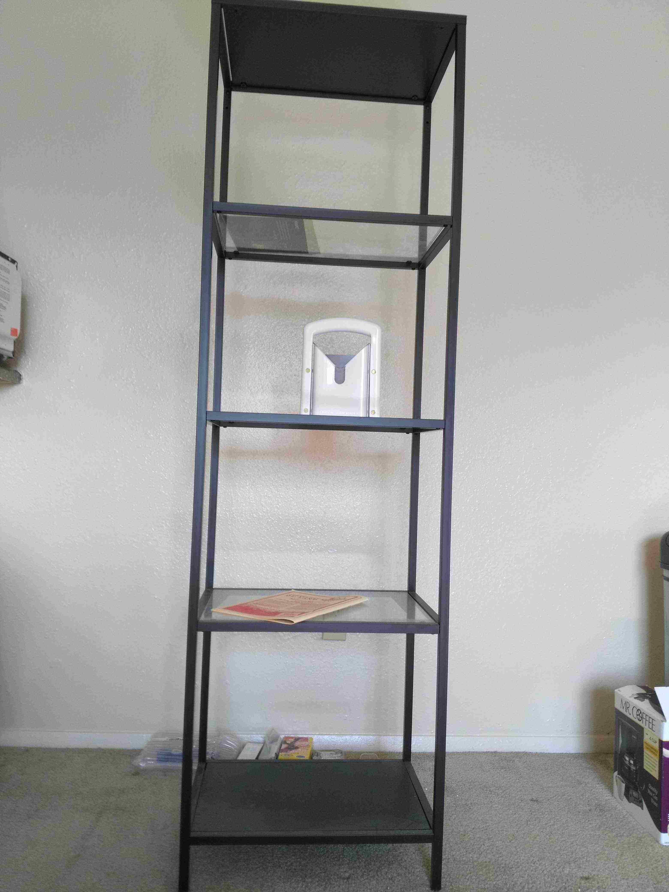
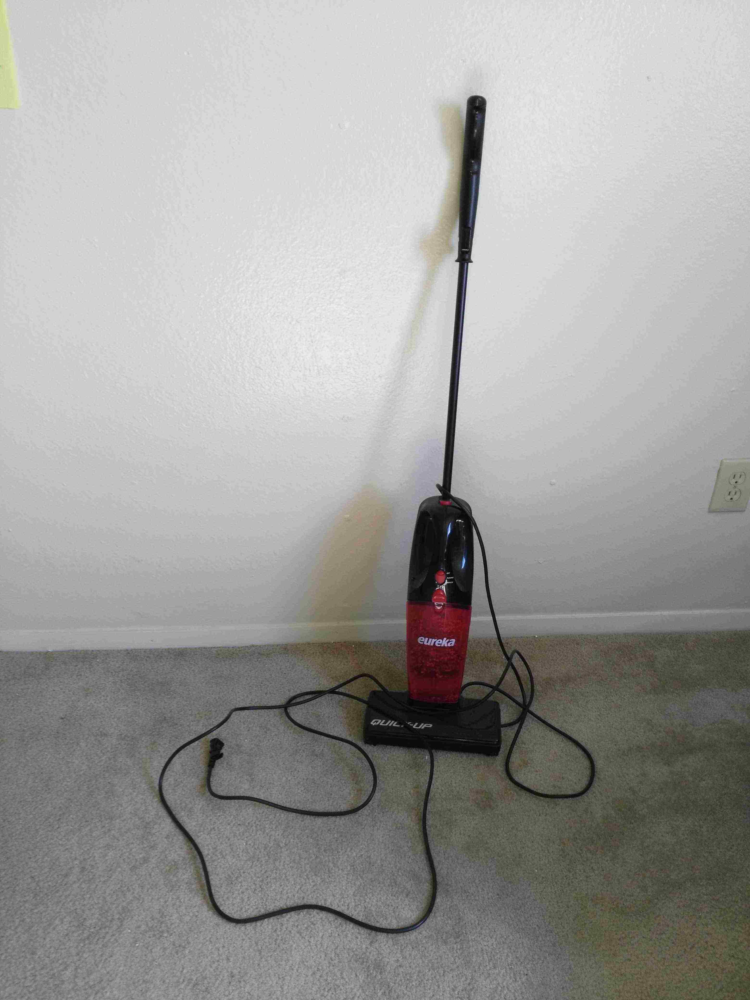
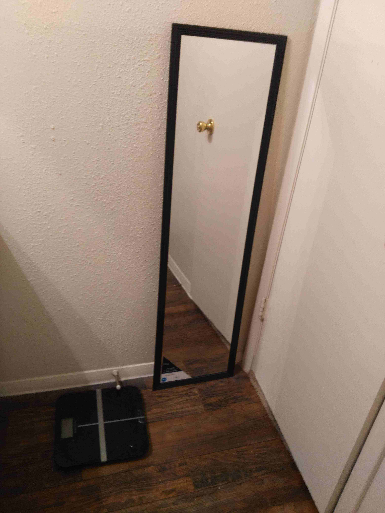
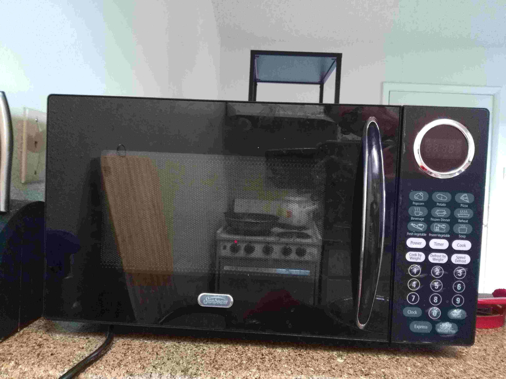
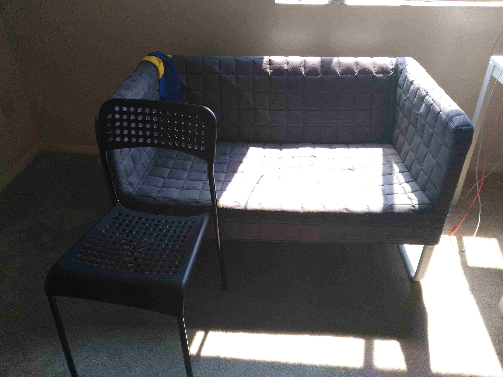
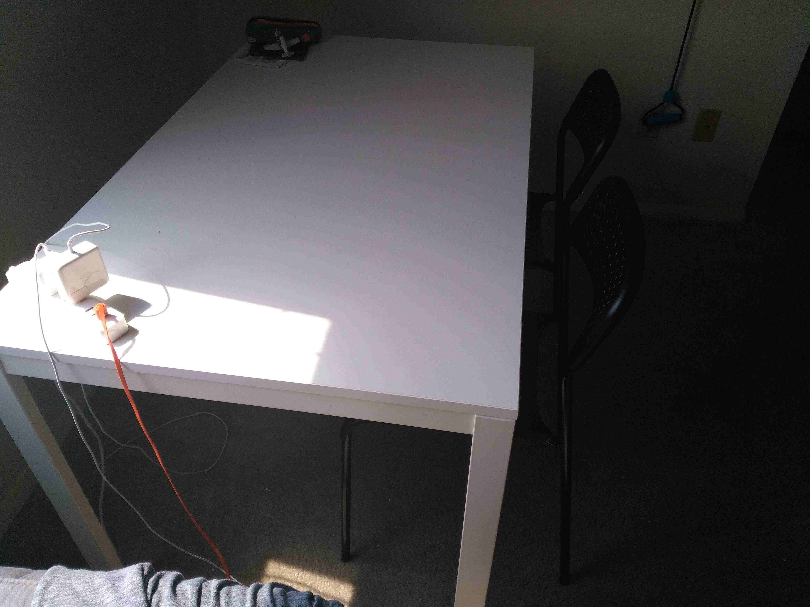
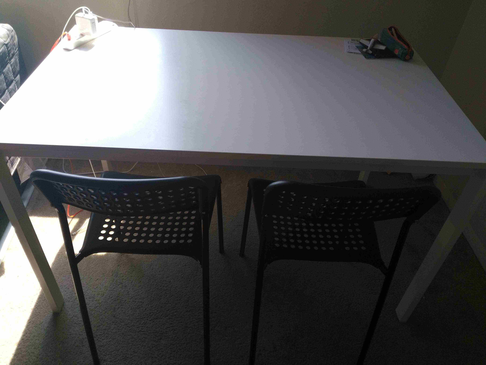
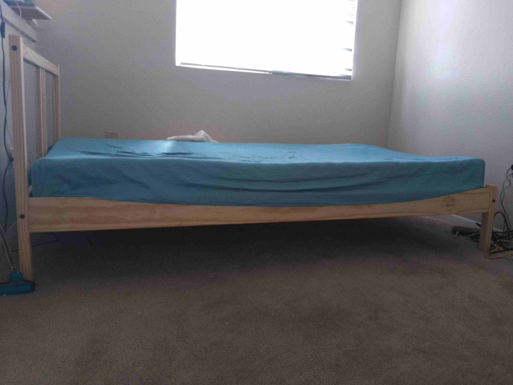
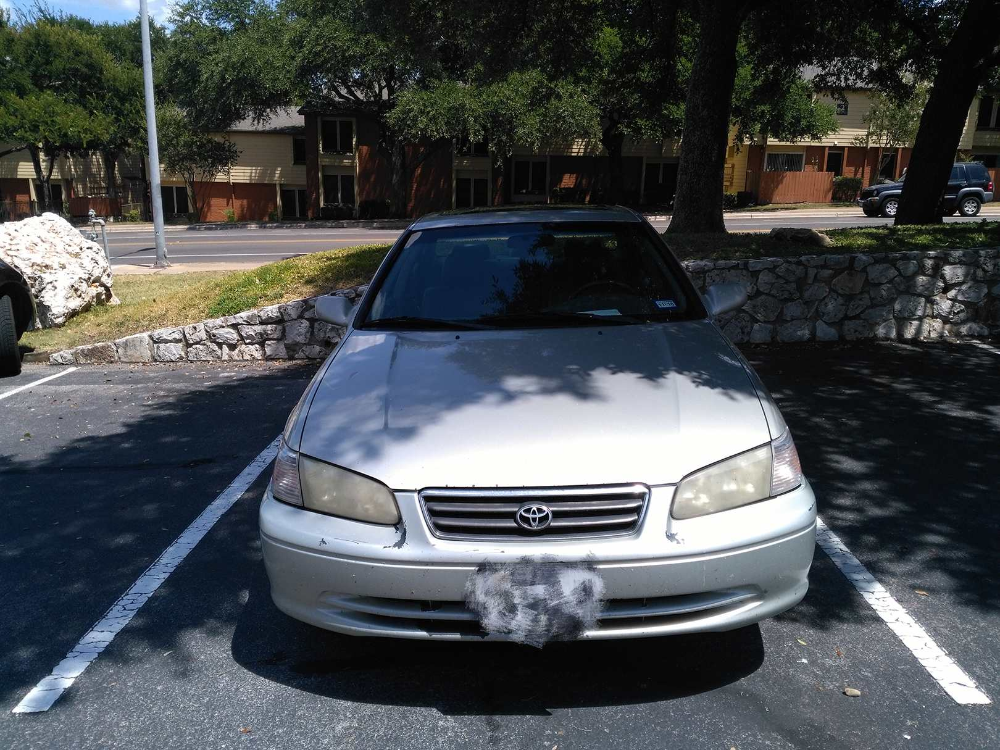

1
======================

所有物品使用年限都在1年以内, 9月末(具体的说 **一直用到09/26** )之前取货.
(原谅我的无能,实在不知道怎么图片贴近去
所有照片都在这里)

联系 512-221 杠 8041. 

modem
========================

购自bestbuy, (10美元)
netgear牌子, 这个手头没图.

架子(10美元)
=======================

那个切面包的附送.

垃圾桶加咖啡壶(10美元)
============================

已经被人预订.

吸尘器(8美元)
=========================

镜子和体重计(25美元)
=========================

塔吉锅 30美元,没图
=========================

这个大号塔吉锅,底是不锈钢的,上面是陶瓷的. 在亚马逊买的.
亚马逊链接 https://www.amazon.com/gp/product/B00KLGSP6O/ref=oh_aui_detailpage_o00_s00?ie=UTF8&psc=1

微波炉 15刀
=======================

沙发,宜家买的(40刀)
=============================

桌子椅子一套 50刀
================================

一个桌子,两把椅子

twinsize床+床垫 70刀
============================

车子1600刀
============================

还有2000年凯美瑞, clean title, 手动档,四门前驱,开了将近一年(买回来里程大概178000mile),没有任何问题, 里程大概186000mile(我是不是很厉害?  ^^).
去年购自dealer. 

联系 512-221 杠 8041. 
